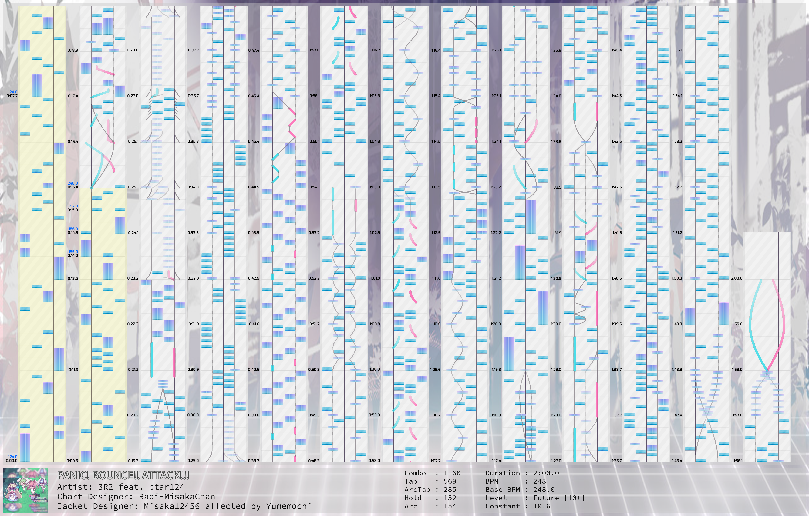

# <p align="center">ArcaeaChartRender
<p align="center">Another chart previewing library for Arcaea.

## requirements

 - pydantic~=1.9.1
 - Pillow~=9.1.1
 - opencv-python~=4.5.5.64
 - numpy~=1.23.0
 - pyparsing~=3.0.9
 - pytest~=7.2.2(for test only, remove it if you don't need to run tests)

```bash
pip install -r requirements.txt
```

Or, if you are using `uv`:

```bash
uv sync
```

## Usage

Render an Arcaea Chart simply.

### change your theme

Before using, you need to copy and rename [`theme.py`](./ArcaeaChartRender/theme.py) to `theme_local.py`, and edit `theme_local.py` to locate assets file.

If a property of `BaseTheme` is inherited by one of its subclasses (e.g. `LightTheme`), you should modify the property on its subclass. If the property is not inherited, then you should modify it directly on `BaseTheme`.

| name                              | file                                                                                                                                |
| --------------------------------- | ----------------------------------------------------------------------------------------------------------------------------------- |
| `font_Exo_SemiBold_XX`            | `Exo-SemiBold.ttf`                                                                                                                  |
| `font_Kazesawa_Regular_XX`        | `Kazesawa-Regular.ttf`                                                                                                              |
| `font_SourceHanMonoSC_Regular_XX` | [`SourceHanMonoSC-Regular.otf`](https://github.com/adobe-fonts/source-han-mono/blob/master/Regular/OTC/SourceHanMonoSC-Regular.otf) |
| `tile_path`                       | `track.png` and `track_dark.png`                                                                                                    |
| `tap_path`                        | `note.png` and `note_dark.png`                                                                                                      |
| `hold_path`                       | `note_hold.png` and `note_hold_dark.png`                                                                                            |
| `arctap_path`                     | `tap_l.png` and `tap_d.png`                                                                                                         |
| `arctap_designant_path`           | `tap_tomato.png`                                                                                                                    |
| `arctap_sfx_path`                 | `sfx_l_note.jpg` and `sfx_d_note.jpg`                                                                                               |
| `default_bg_path`                 | `base_light.jpg` and `base_conflict.jpg`                                                                                            |
| `custom_bg_dir_path`              | put your custom background here if `bg` field has been defined in songlist                                                          |

 > ⚠ Note: <br> This repo does **NOT** provide these assets files, you need to obtain them by yourself. It is recommended to get them at [Arcaea-Infinity/OpenArcaeaArts](https://github.com/Arcaea-Infinity/OpenArcaeaArts) (Licensed under `CC BY-NC`).

### render chart with a `songlist`

When rendering the official chart, you deserve to have a `songlist` from which you can build the song metadata.

```python
from ArcaeaChartRender.render import Render
from ArcaeaChartRender.utils import fetch_song_info

render = Render(
    aff_path='./songs/panicbounceattack/2.aff',
    cover_path='./songs/panicbounceattacki/base.jpg',
    song=fetch_song_info('./songs/songlist', 'panicbounceattack'),
    difficulty=2,
    constant=7.0,
)

render.show()
render.save('panicbounceattack_2.png')
```

### render chart without `songlist`

In some cases, you may not be conscious of creating a `songlist` (e.g. fan-made chart), then you can use the `Song` model instead of the `fetch_song_info()` function.

```python
from ArcaeaChartRender.render import Render
from ArcaeaChartRender.model import Song

my_song = Song(
    **{
        "id": "panicbounceattack",
        "idx": 0,
        "title_localized": {
            "en": "PANIC! BOUNCE!! ATTACK!!!"
        },
        "artist": "3R2 feat. ptar124",
        "bpm": "248",
        "bpm_base": 248,
        "set": "base",
        "purchase": "",
        "audioPreview": 94798,
        "audioPreviewEnd": 110250,
        "side": 0,
        "bg": "shiawase2",
        "version": "3.12.6",
        "date": 1649603401,
        "difficulties": [
            {
                "ratingClass": 2,
                "chartDesigner": "Rabi-MisakaChan",
                "jacketDesigner": "Misaka12456\naffected by\nYumemochi",
                "rating": 10,
                "ratingPlus": True
            }
        ]
    }
)

render = Render(
    aff_path='./songs/panicbounceattack/2.aff',
    cover_path='./songs/panicbounceattacki/base.jpg',
    song=my_song,
    difficulty=2,
    constant=7.0,
)

render.show()
render.save('panicbounceattack_2.png')
```

## Example



 - The yellow area means that the BPM in that area is not equal to the `bpm_base` of the song.

## Side Usage

In addition to rendering charts, you can use the library to do the following things.

### chart syntax check

A minimal syntax check for individual commands in a chart.

```python
from ArcaeaChartRender.aff.decoder import parse_aff
from ArcaeaChartRender.utils import read_file

chart = parse_aff(read_file('./songs/panicbounceattacki/2.aff'))
for cmd in chart.command_list:
    print(cmd.syntax_check(), cmd)
```

### chart statistics

Statistical information such as combo calculation.

See [`element.py`](./ArcaeaChartRender/element.py) for more information.

```python
from ArcaeaChartRender.aff.decoder import parse_aff
from ArcaeaChartRender.element import Tap
from ArcaeaChartRender.utils import read_file

chart = parse_aff(read_file('./songs/panicbounceattacki/2.aff'))
print(chart.get_total_combo())
print(chart.get_combo_of(Tap))
print(chart.get_bpm_proportion())
print(chart.get_interval())
...
```

### aff plain text parsing

Compose your Arcaea chart by Python DSL, and easily convert plain text of aff file to `dict` or `list`.

See [`aff_parsing.py`](./ArcaeaChartRender/aff/parsing.py) for more information.

```python
from ArcaeaChartRender.aff.parsing import command
from ArcaeaChartRender.utils import read_file

content = read_file('./songs/panicbounceattacki/2.aff')
print(command.parse_string(content).as_dict())
print(command.parse_string(content).as_list())
...
```

## TODO

 - [ ] beautify text style (at text area)
 - [x] add support for segmented combo count (per bar)
 - [x] add support for custom background (when `Song.bg` field is not `None`)
 - [ ] other chart statistics (density, multi-finger, crossed hand, etc.)

## License

 - `BOFXVI - PANIC! BOUNCE! ATTACK!!!` from [Arcaea-Infinity/FanmadeCharts](https://github.com/Arcaea-Infinity/FanmadeCharts) under `616 SB License`
 - `Aff2Preview` from [Arcaea-Infinity/Aff2Preview](https://github.com/Arcaea-Infinity/Aff2Preview) under `616 SB License`
 - `pyparsing` from [pyparsing/pyparsing](https://github.com/pyparsing/pyparsing) under `MIT License`
 - `opencv2` from [opencv/opencv-python](https://github.com/opencv/opencv-python) under `MIT License`
 - `Pillow` from [python-pillow/Pillow](https://github.com/python-pillow/Pillow) under `HPND License`

This project is licensed under the terms of the [`616 SB License`](./LICENSE).
